# KITSYUU: Japanese streetwear, brought to India

A dark, editorial prototype e-commerce storefront for **KITSYUU**, plus the brand's cinematic landing page. The whole site is static HTML, CSS and vanilla JavaScript. There is no framework, no build step and no runtime dependency.

> **Prototype status.** Product names, sizes, prices and descriptions come from a prototype catalogue and are estimates, not confirmed company data. Product images are prototype-quality cutouts taken from the catalogue PDF. Checkout is a demonstration: no payment is taken, no order is placed and nothing is sent anywhere.

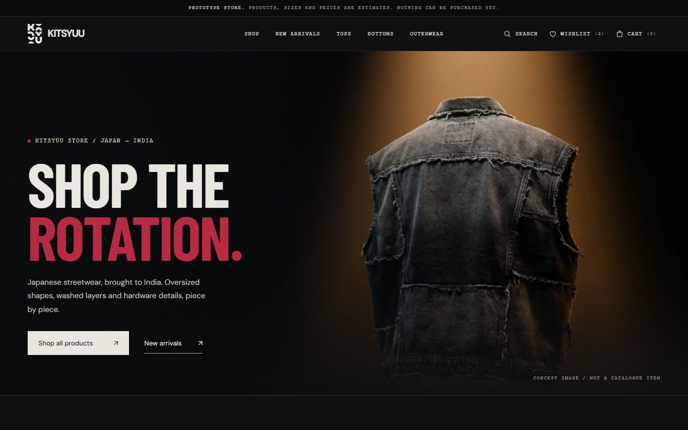

## Contents

- [Features](#features)
- [Screenshots](#screenshots)
- [Architecture](#architecture)
- [Setup guide](#setup-guide)
- [Project structure](#project-structure)
- [Testing](#testing)
- [Future improvements](#future-improvements)
- [Lessons learned](#lessons-learned)

## Features

### Store (`dist/store/`)
- **Catalogue**: 22 products in three categories (Tops, Bottoms, Outerwear) and seven subcategories, all rendered from a single `products.json`.
- **Store home**: masthead, New Arrivals, Shop by Category, an editorial banner, Featured pieces, an Outerwear banner, a newsletter form (prototype, stores nothing) and the store footer.
- **Listing pages**: Shop All, category and subcategory pages, and the New Arrivals collection, with a result count and subcategory tabs.
- **Sorting**: catalogue order, New Arrivals first, Featured first, and price low→high / high→low. The sort is kept in the URL and carried across category tabs.
- **Search**: matches product name, SKU (with or without hyphens), category and subcategory. Includes an empty state with category links.
- **Product page**: image panel (zoom deliberately off for catalogue-resolution images), size selector, quantity stepper, Add to cart, wishlist, details / material & care / product data accordions, "Complete the look" and "More in this category" rails. The gallery is ready for more official photos later.
- **Cart**: saved in `localStorage` and re-checked against the catalogue on every read. Adding the same product and size merges into one line; a different size gets its own line. Up to 10 per line. Includes quantity controls, remove, subtotal and a live header count.
- **Wishlist**: heart toggles on every card and on the product page, a wishlist page, a live header count, and sync across browser tabs.
- **Checkout (prototype)**: contact and shipping form with inline validation. The payment section is clearly marked as a prototype and has no payment fields. Includes an order summary.
- **Confirmation (prototype)**: generates a reference such as `KTS-PROTO-260925-G7P8`. The cart is cleared only after the confirmation has been saved. The page states plainly that no real order was placed.
- **Held-image fallback**: a "Photo coming soon" panel for any product whose photo is withheld.
- **Hero turntable integration point**: a dormant player for a future real 360° frame sequence of KTS-OUT-001. It is off until a manifest is configured, and `hero.webp` shows until then.
- **Accessibility**: skip link, visible focus rings, semantic buttons and links, `aria-pressed` on wishlist hearts, live status messages, labelled form fields with linked error messages, and a keyboard-operable mobile menu (Esc closes it and focus returns). Honours `prefers-reduced-motion` and the site's own reduce-motion setting.
- **Responsive** at desktop, tablet and mobile sizes, with no horizontal scrolling (checked at 1440, 1024, 768 and 390 px).

### Brand landing page (`dist/landing.html`, parked)
- A cinematic, scroll-driven canvas film (241 WebP frames at 2560×1440) played by a `FramePlayer` with a limited frame cache and a reduced-motion fallback.
- Style-study sections, an editorial section, and a style tile (`dist/style-tile.html`) that shares the design tokens.
- **Temporarily parked** while the store is built: the site root (`dist/index.html`) redirects to `/store/`. See [Restoring the landing page](#restoring-the-landing-page).

## Screenshots

| Shop All | Product page |
|---|---|
| 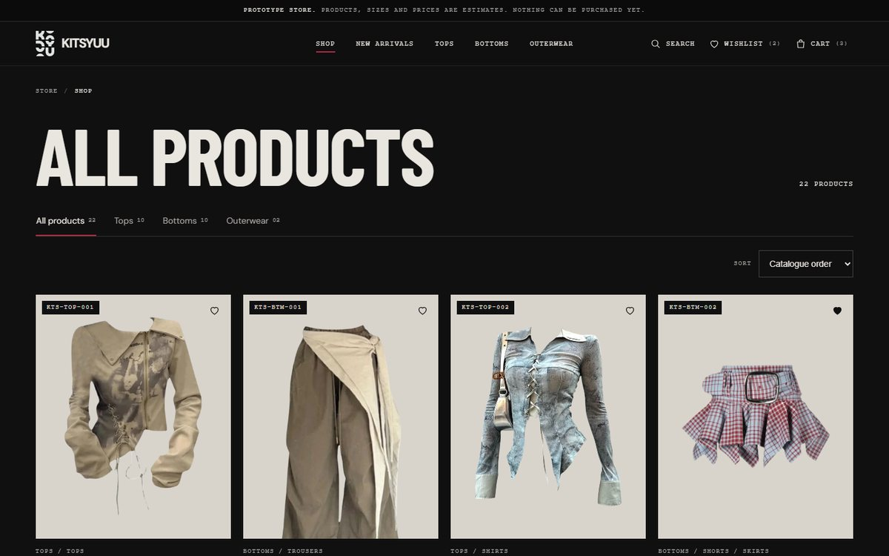 | 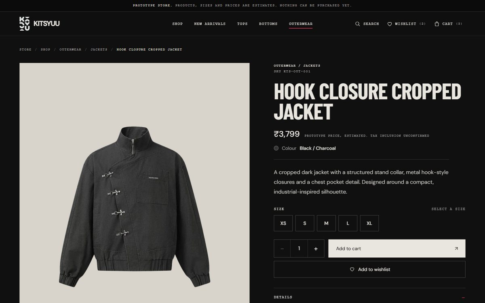 |
| **Cart** | **Checkout (prototype)** |
| 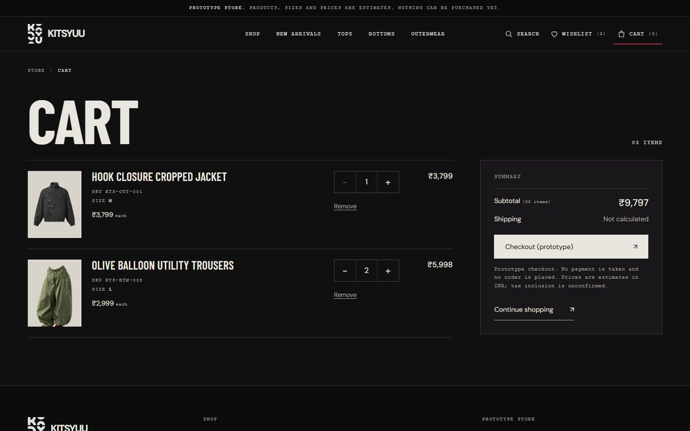 | 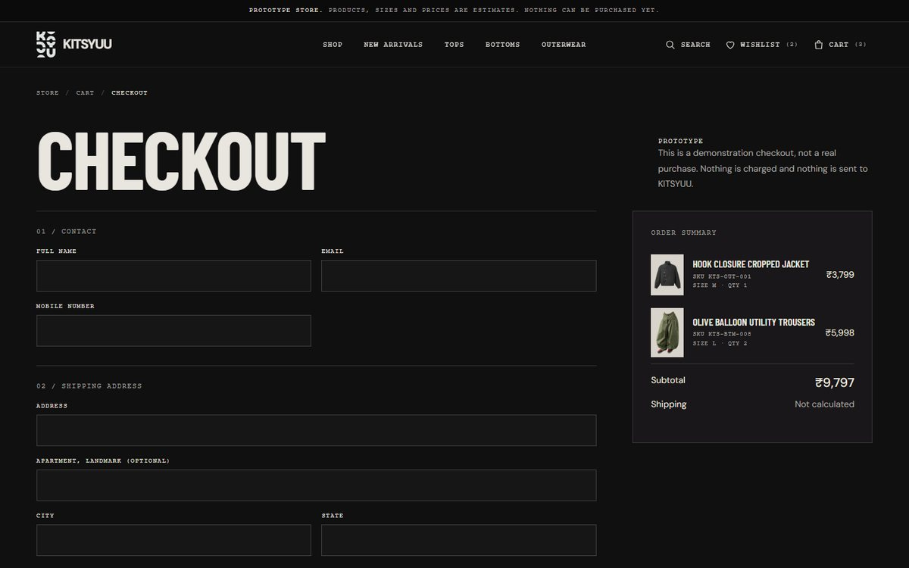 |
| **Search** | **Prototype order confirmation** |
| 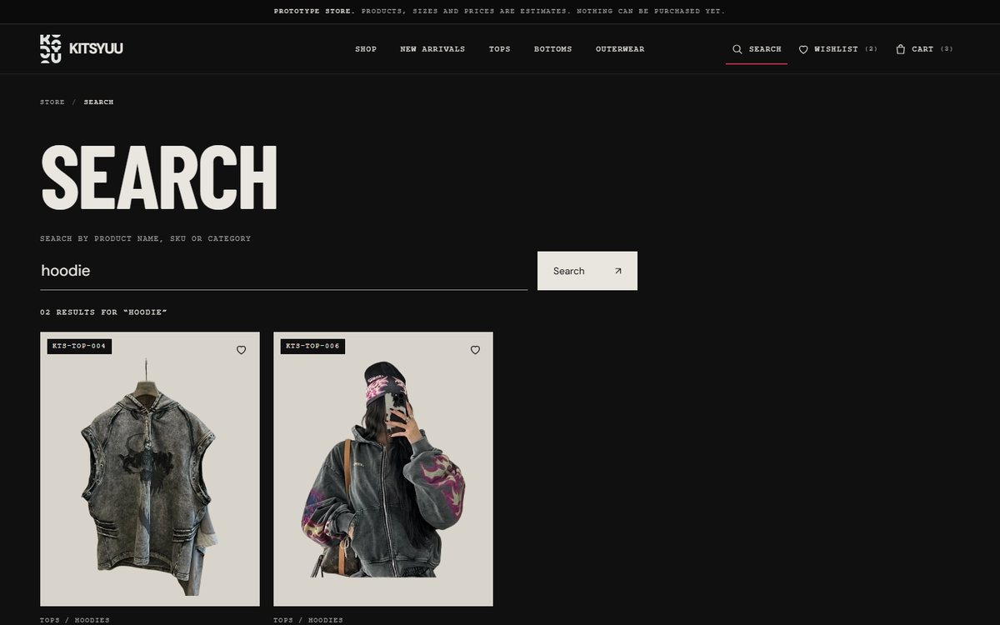 | 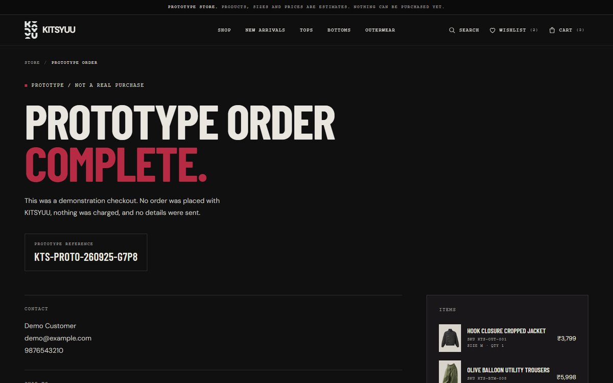 |

**Mobile (390 px)**

| Home | Product | Cart | Menu |
|---|---|---|---|
| 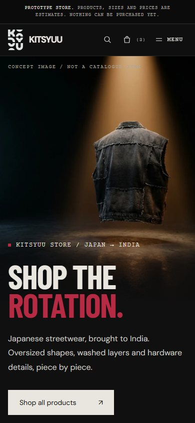 | 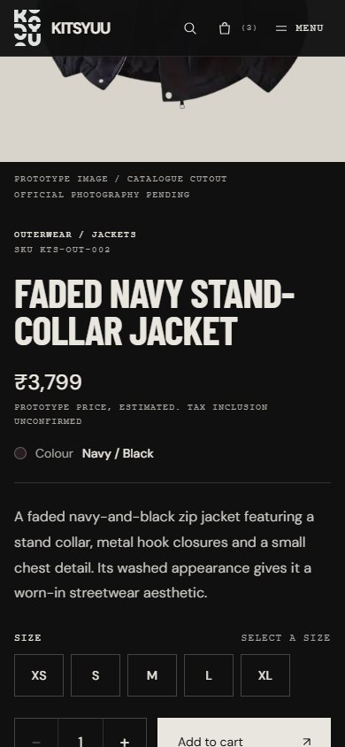 | 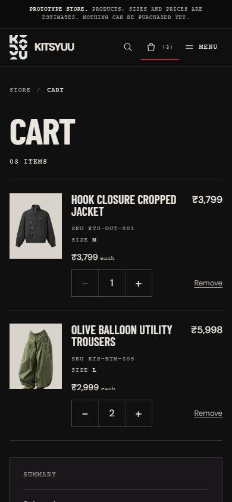 | 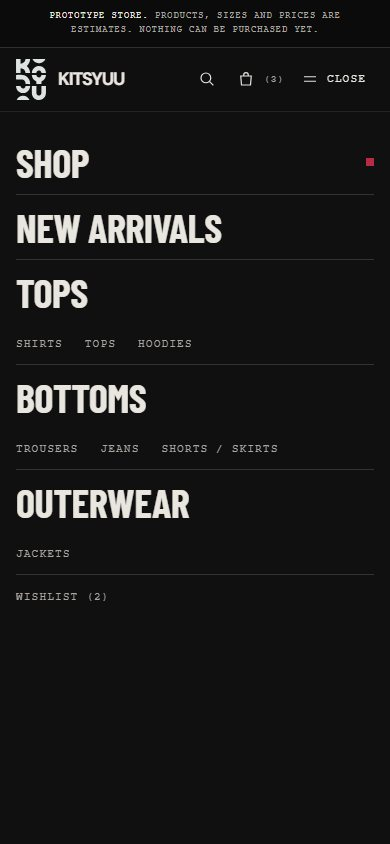 |

**Brand landing page (parked)**

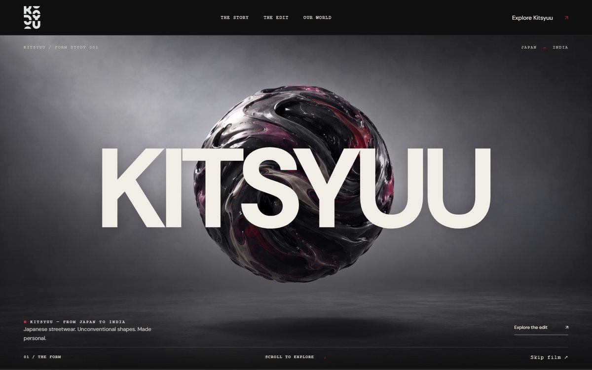

## Architecture

The site is plain static files. Every store page is a small HTML shell. A single script, `store.js`, reads `data-page` on `<body>`, loads `products.json` and renders that page. The only state lives in the browser.

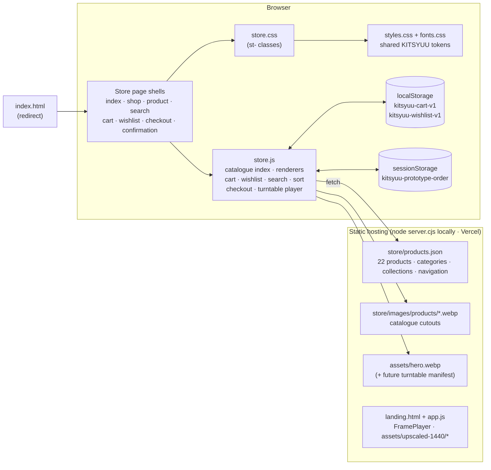

**Key decisions**
- **Multi-page with query strings** (`shop.html?category=tops.hoodies`, `product.html?p=<slug>`), not a single-page app. It works on the bundled static server and on Vercel with no rewrite rules.
- **`products.json` is the only source of truth.** Cart lines store the fields you'd expect (id, SKU, name, image, price, size, quantity), but every read is checked against the catalogue, so a stale or edited entry can't show a wrong price.
- **The store styles reuse the landing page's tokens** by loading `../styles.css` first. Every store class uses the `st-` prefix, so nothing leaks into the landing page.
- **No backend yet.** Checkout, confirmation and the newsletter form are honest prototypes that send nothing.

## Setup guide

**Requirements:** [Node.js](https://nodejs.org/) 18 or newer (only for the tiny static server). No `npm install` is needed.

```bash
git clone https://github.com/Nivetha-K-max/Kitsyuu_E-Commerce.git
cd Kitsyuu_E-Commerce
node server.cjs
```

Then open:

| URL | What |
|---|---|
| http://127.0.0.1:3000/ | Redirects to the store |
| http://127.0.0.1:3000/store/ | Store home |
| http://127.0.0.1:3000/landing.html | Parked brand landing page |
| http://127.0.0.1:3000/style-tile.html | Design style tile |

On Windows you can double-click `Start-Kietsu.cmd` instead. Always open the site through the server rather than as `file://`, because the store fetches `products.json`.

**Deploying:** serve the `dist/` folder as static files (Vercel, Netlify, GitHub Pages, any static host). No build step is needed.

### Editing content
- **Products:** `dist/store/products.json`. See [`PRODUCT-DATA.md`](PRODUCT-DATA.md) for field meanings, image rules and how to swap in official photography.
- **Store look:** `dist/store/store.css`, which reuses the shared tokens in `dist/styles.css`.
- **Landing copy:** `dist/content.json`, then run `node sync-content.cjs` once the landing page is restored.

### Restoring the landing page
1. Rename `dist/landing.html` back to `dist/index.html`, replacing the redirect.
2. In `dist/store/store.js`, set `const LANDING=asset('');` to bring back the store's links to the brand story.

### Enabling the hero turntable (future)
Add a real turntable frame sequence of KTS-OUT-001 under `dist/assets/`. Write a manifest in the same format as `assets/sequence.json`, plus `loop` and `stillFrame`. Put its path in `data-turntable` on the hero in `dist/store/index.html`. The format is documented above `TurntablePlayer` in `store.js`.

## Project structure

```
KITSYUU-Website2/
├── dist/                       # everything that gets deployed
│   ├── index.html              # redirect → store/ (landing parked)
│   ├── landing.html            # brand landing page (parked)
│   ├── app.js · styles.css     # landing FramePlayer + shared design tokens
│   ├── fonts.css · assets/     # local fonts, logo, hero, frame sequences
│   ├── style-tile.html
│   └── store/
│       ├── index.html shop.html product.html search.html
│       ├── cart.html wishlist.html checkout.html confirmation.html
│       ├── store.js · store.css
│       ├── products.json
│       └── images/  (products/*.webp, placeholder.svg)
├── apps/                       # platform workspace (npm workspaces, see package.json)
│   ├── website/                # customer website: Next.js + Supabase (npm run build:website)
│   └── admin/                  # Admin/ERP app (placeholder until M3)
├── packages/                   # shared server packages: db, core, auth, contracts (placeholders until M2/M3)
├── database/                   # migrations/, seed/, scripts/ and setup-all.sql (npm run db:*)
├── package.json · tsconfig.base.json
├── docs/screenshots/           # README images
├── source-assets/              # original logo, stills, videos, prompts
├── PRODUCT-DATA.md             # catalogue data guide
├── PRODUCTION-NOTES.md         # landing-page media provenance
├── server.cjs · Start-Kietsu.cmd
└── sync-content.cjs · validation.json
```

## Testing

The store was verified with a headless-Chrome suite (driven over the Chrome DevTools Protocol, no test dependencies) at 1440 px and 390 px. The suite scripts aren't part of this repo.
- **Phase 1 (50 checks):** all 22 products and product pages, every category route, image resolution, the held-image fallback, the Featured / New Arrivals lists, the mobile menu and keyboard behaviour, and no horizontal overflow.
- **Phase 2 (83 checks):** size-required add to cart, merging the same size, separate lines for different sizes, the quantity cap, + / − and remove, refresh persistence, wishlist toggle and persistence, empty states, search cases, sorting, checkout validation, prototype order → confirmation, and cart clearing.
- **Phase 3 audit:** 16 page states at 1440 / 1024 / 768 / 390 px, checked for overflow, clipped text, tap targets and grid alignment. Plus keyboard focus visibility and reduced motion.

Final result: **133 / 133** checks passing, with no console errors.

## Future improvements
- **Real turntable:** shoot a 360° turntable of KTS-OUT-001 and plug it into the prepared hero player.
- **Official photography:** replace the catalogue cutouts (see `PRODUCT-DATA.md`) and enable zoom for images at least 1500 px on the long edge.
- **Confirmed commercial data:** prices, GST treatment, size charts, stock per size, materials and care.
- **Backend:** a real order API, a payment gateway (Razorpay or Stripe), shipping and tax calculation, and order emails.
- **Accounts:** customer accounts so cart and wishlist follow the shopper across devices.
- **Price filter** and other filters once the catalogue grows. Changing size directly on the cart page.
- **Image rights:** confirm rights and consent for the catalogue photos (see the review flags in `PRODUCT-DATA.md`).
- **Restore the landing page** as the site root and link it to the store.
- **Automated tests:** add the headless-Chrome suite to the repo and run it in CI.

## Lessons learned
- **Honest prototypes build trust.** Labelling estimated prices, catalogue-grade images and the demonstration checkout clearly avoided presenting fake data as real.
- **One source of truth pays off.** Rendering every page from `products.json`, and re-checking stored cart lines against it, made catalogue changes and image swaps safe.
- **Don't fake what the assets can't support.** A requested 360° rotation turned out to have no real source footage. Documenting what's missing and building a dormant integration point beat faking it with CSS.
- **Reuse beats rebuild.** Sharing the landing page's design tokens and frame-player approach kept the store visually consistent without touching the landing code.
- **Measure before polishing.** Automated overflow, alignment and tap-target probes at several widths found real bugs (a 1 px tablet overflow, misaligned prices) that a visual pass would miss.
- **Keep a regression baseline.** Re-running the full suite after every change caught test-side mistakes quickly and kept every phase at 100%.

## Credits
Brand, catalogue and imagery © KITSYUU. Landing-page concept imagery and film are documented in [`PRODUCTION-NOTES.md`](PRODUCTION-NOTES.md). Fonts: Barlow Condensed and DM Sans (Google Fonts, served locally).
