# KITSYUU: Japanese streetwear, brought to India

KITSYUU is an **e-commerce store and an ERP / business-management back office** built as one platform:

- a customer website, with the brand's cinematic landing page and the store on one homepage;
- a separate Admin/ERP application;
- shared server packages holding the business logic;
- one PostgreSQL database.

> **Business rules.** Decided rules are configuration: unpaid orders hold their stock for 10 days, customers may cancel their own unpaid orders, a new checkout replaces an older unpaid one, and all sales are final (no returns or refunds). Rules not decided yet (payment provider, shipping charges, tax rules) are left **unset and configurable**, never guessed. There are no discounts at launch.

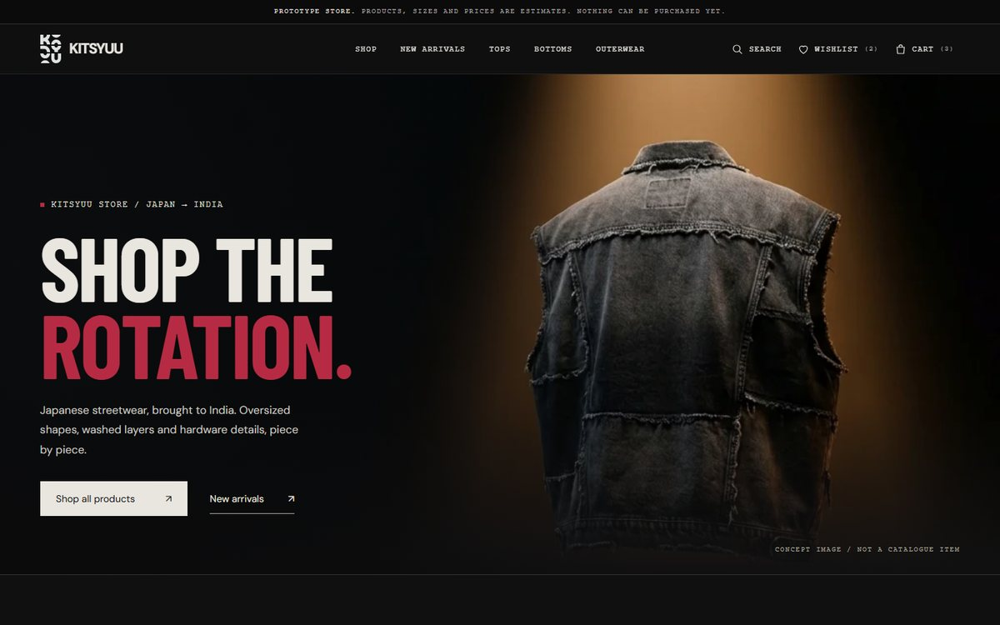

## Contents

- [Status](#status)
- [Features](#features)
- [Screenshots](#screenshots)
- [Architecture](#architecture)
- [Setup guide](#setup-guide)
- [Configuration](#configuration)
- [Testing](#testing)
- [Project structure](#project-structure)
- [Future improvements](#future-improvements)
- [Lessons learned](#lessons-learned)

## Status

The platform is built in milestones. Each is reviewed before it moves on. **Production (`main`) runs up to M4.** Later milestones are on review branches until they are approved.

| Milestone | Scope | State |
|---|---|---|
| M0–M2 | Monorepo, database foundation (roles, RLS, stock ledger, billing tables, audit log) | Live |
| M3–M4 | Admin/ERP: staff login, roles and permissions, audit; catalogue, variants, images, inventory, orders | Live |
| M5 | Landing and store combined on one `/` homepage | Branch `m5-restore-landing` |
| M6 | Customer accounts on the platform: signup, email verification, login, sessions, password reset, addresses, order history | Branch `m6-customer-auth`; database migrations live |
| M7 | Core commerce: database cart and wishlist, server-side pricing, checkout, order creation with stock reservation, order workflow, provider-neutral payments | Branch `m7-commerce`; migration 1600 not yet applied |
| M8 | ERP operations: customers, payment operations and exceptions, fulfilment (manual courier), settings registry, order export, operations dashboard (no returns/refunds: all sales are final) | Committed on branch `m9-integration` (local, not pushed); migrations `20260929001800`–`001900` applied to local test databases only |
| M9 | Production hardening: M8 integrated with the homepage/filters/attributes work; storefront security headers (CSP); checkout rate limit; `/api/health` on both apps; admin System page; sign-in history in the audit area | Branch `m9-integration` (local); migration `20260929002000` local only |
| M10 | Commerce go-live configuration: delivery charge chosen in Settings ("Not set up" until then), company details, HSN code per product, printable packing slip. Tax/GST invoices wait for the tax decision | Branch `m9-integration` (local); migration `20260929002100` local only |
| M11 | Catalogue completion: Collections admin (hidden until shown, ordered store menu), "Complete the look" links, bulk product status, SEO title/description per product | Branch `m9-integration` (local); migration `20260929002200` local only |
| M12 | Reviews and ratings: verified purchases only ("paid" or "delivered" chosen in Settings; closed until then), stars, text and up to 3 photos, staff approval before anything is public, ratings filter and sort in the shop | Branch `m9-integration` (local); migration `20260929002300` local only |
| M13 | Vendors, materials and purchasing: material stock with its own ledger, purchase orders (draft → ordered → partially received / received, or cancelled), deliveries in parts, purchase prices visible only with `costs.read` | Branch `m9-integration` (local); migration `20260929002400` local only |
| M14 | Production and quality control: production orders per size, materials used drawn from material stock, completion by quality check (passed pieces into stock through the ledger, rejected recorded with a reason). Manufacturing stages are not modelled (not decided) | Branch `m9-integration` (local); migration `20260929002500` local only |
| M15 | Stock counts (snapshot, count, post only the differences through the ledger) and stock value (entered unit costs for pieces, last purchase price for materials; no costing method is assumed) | Branch `m9-integration` (local); migration `20260929002600` local only |
| M16 | Reports: sales (paid orders only, IST business days, average order), best sellers and categories, stock and movements, new/returning customers, purchasing spend (with `costs.read`), production pass rate; CSV export of each (formula-safe, audited). No database change | Branch `m9-integration` (local) |

## Features

### Customer website (`apps/website`)
- **One homepage**: the scroll-driven landing film (241 WebP frames), then the store at `#store`. The Store link jumps straight to it.
- **Catalogue**: 22 products in three categories and seven subcategories, New Arrivals, Featured, sorting, search, and a product page with sizes, quantity and wishlist. Catalogue pages are statically generated.
- **Customer accounts** (M6):
  - Signup with email verification, login, logout and "sign out everywhere".
  - Password change and reset, personal information, delivery addresses, order history, and a security page listing active sessions.
- **Cart and wishlist** (M7):
  - Guests keep them in the browser.
  - After login they are merged into the customer's account and saved in the database.
  - Prices and stock are always checked on the server.
- **Checkout** (M7):
  - Choose a saved delivery address and see the server-priced total.
  - Place the order: it is created in one transaction, and its stock is held through the stock ledger.
  - Pay through the configured payment provider, then land on the order confirmation page.
  - Declined payments can be retried. Customers can cancel their own unpaid orders, which returns the stock.
- **Clear failure states**: sold-out or changed items, a changed total, a declined payment, a closed payment window, the payment service or database being unavailable, a network cut, and an ended session.
- **Accessibility and responsiveness**: labelled fields with linked errors, focus management, live status messages, reduced-motion support, and no horizontal scrolling at 1440–390 px.

### Admin/ERP (`apps/admin`)
- Staff accounts with invitations, roles, fine-grained permissions (no privilege escalation) and an append-only audit log.
- Dashboard, products (create, edit, status, price), categories, sizes, images, New Arrivals, stock adjustments with reasons, and orders (list, filters, detail, status changes along the workflow).
- **M8 operations (local only, not deployed):**
  - **Customers**: list with search and filters, order counts, lifetime value and last order; detail with contact, addresses, orders, safe session and login activity, and audit. Disable (ends every session at once) and enable, and contact corrections, all audited with a reason. No secret is ever shown: the admin database role cannot read password or token hashes.
  - **Payments**: payment attempts with filters, provider notifications (webhooks, without their content), and an exceptions queue (paid after cancel, amount mismatch, duplicate payment, paid without a payment record). The only action is recording that money received for a cancelled order was refunded by hand; nothing is sent to a provider.
  - **Fulfilment** inside the order page: packing progress while processing, the courier (manual for now) and an optional tracking number when shipping, shipped and delivered times. The order status stays the one status.
  - **Settings**: a typed registry. Business rules (10-day hold, pricing, tax, account security) are shown locked with the reason; only the low-stock level can be changed, and every change is audited.
  - **Order export** (CSV of the filtered list, capped, audited) and **dashboard** figures for awaiting fulfilment, shipped, delivered, pending payments, payment exceptions and disabled customers.

### Platform
- **Business logic in `packages/core`**, used by both apps. Validation and the order workflow live in `packages/contracts`.
- **Security**:
  - Argon2id passwords.
  - Session tokens stored only as hashes, in `__Host-` HttpOnly cookies.
  - A separate database role per app, and row-level security on every table.
  - Stock changes only through the ledger; the audit log is append-only.
- **Providers instead of hardcoded services**: payments, shipping, email and storage plug in through interfaces. Tax comes from the `tax_rates` table and discounts from rules.

## Screenshots

| Checkout (signed in) | Order confirmation |
|---|---|
| 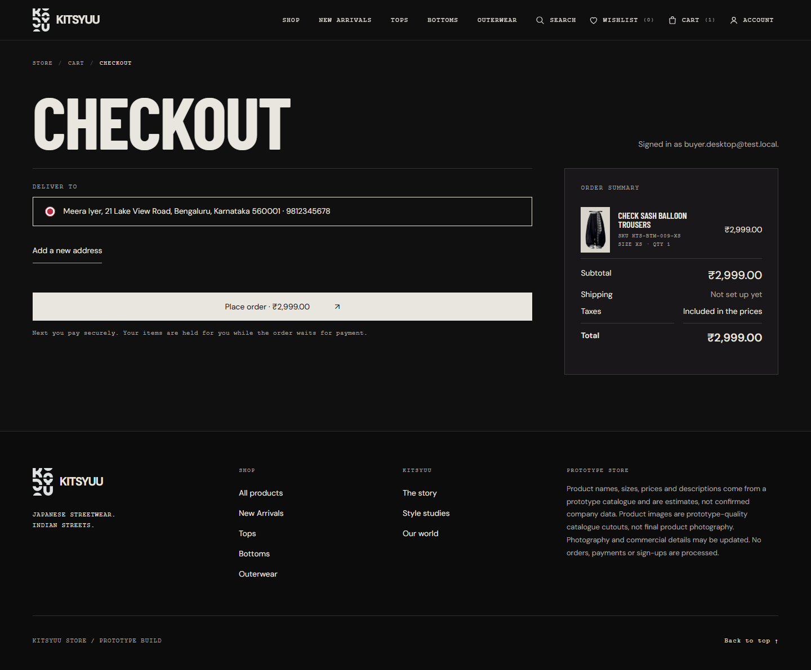 | 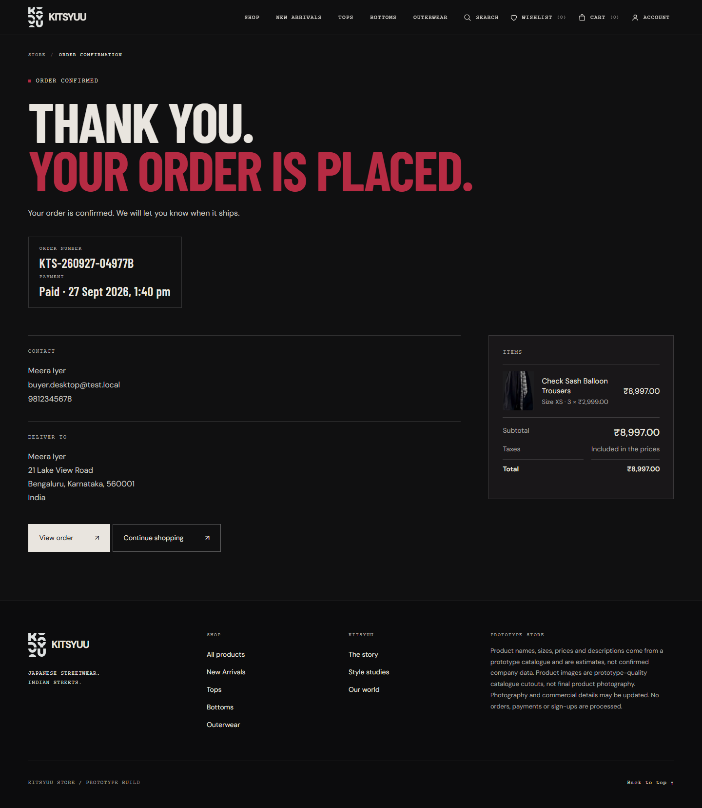 |
| **Shop All** | **Product page** |
| 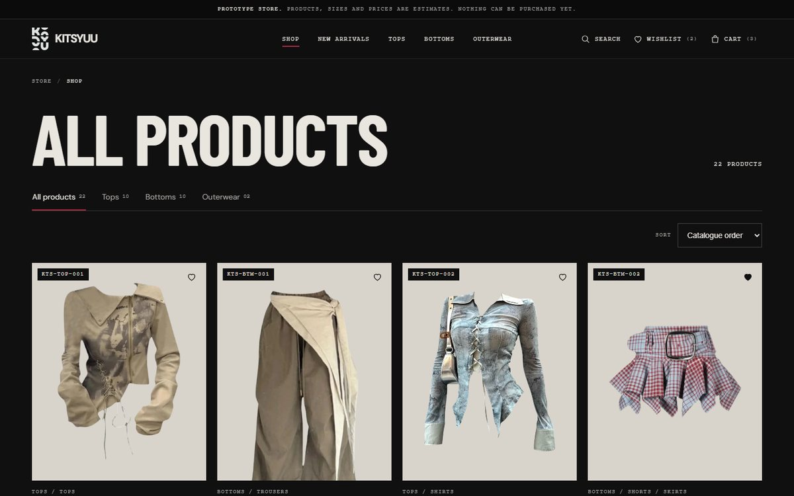 | 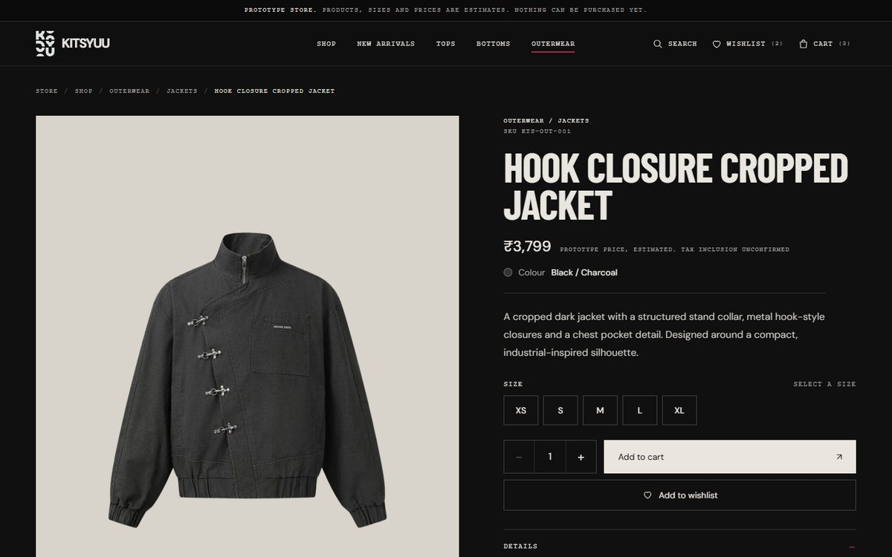 |
| **Cart** | **Checkout as a guest (asks to log in)** |
| 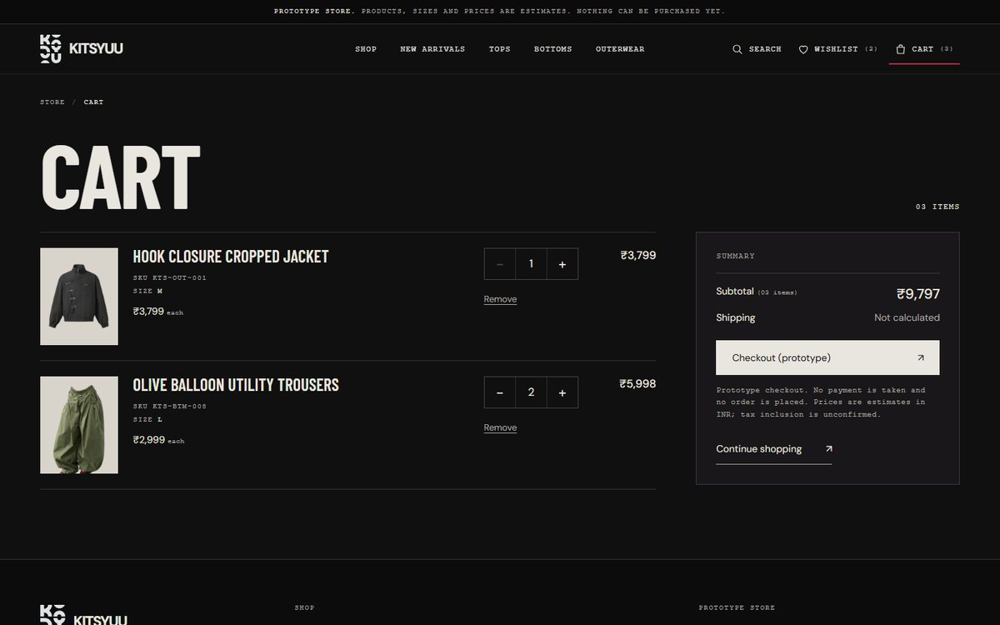 | 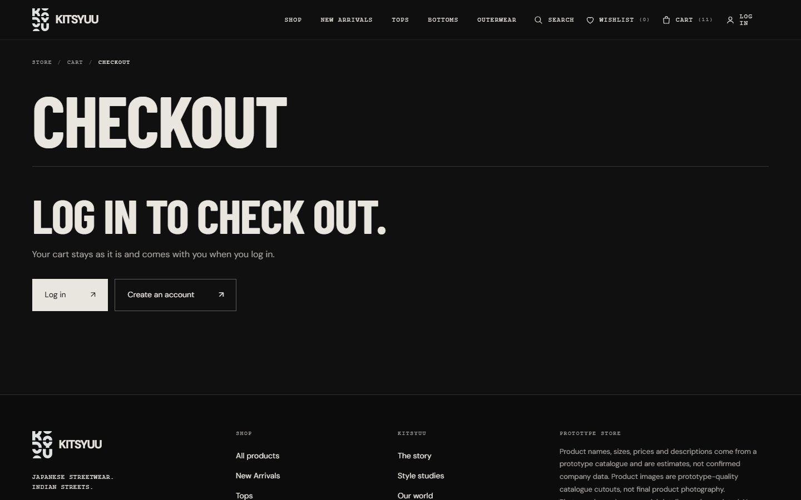 |

**Mobile (390 px)**

| Home | Product | Cart | Checkout | Menu |
|---|---|---|---|---|
| 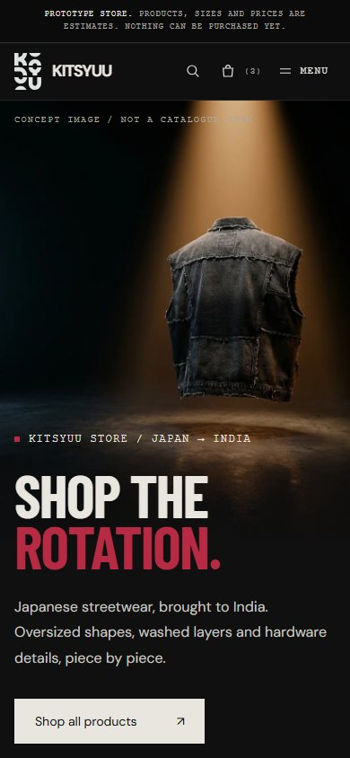 | 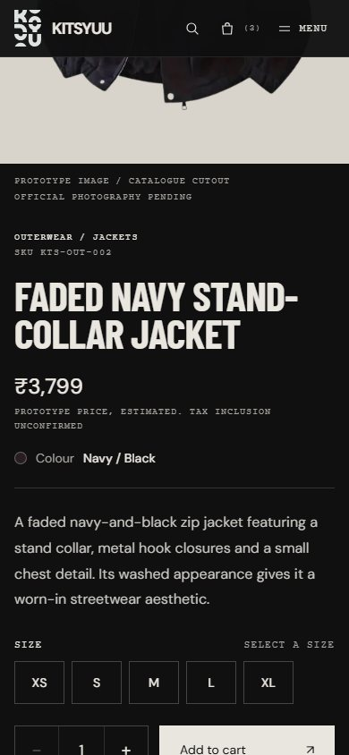 | 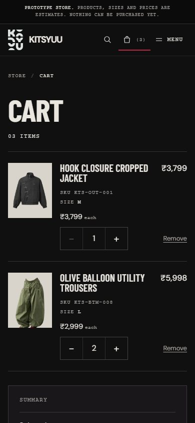 | 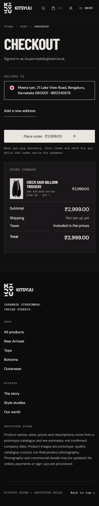 | 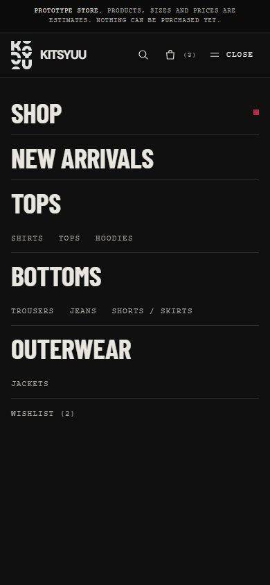 |

**Brand landing**


The screenshots of checkout and confirmation come from the automated tests. They use test accounts and a local database.

## Architecture

The full description, with the database and security model, the commerce flow, the order workflow and the providers, is in [**docs/ARCHITECTURE.md**](docs/ARCHITECTURE.md).

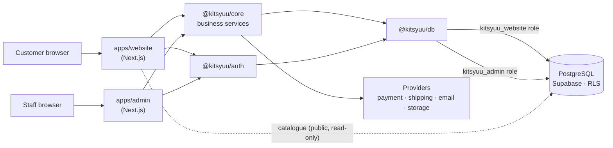
```mermaid
flowchart LR
  C["Customer browser"] --> W["apps/website<br/>(Next.js)"]
  S["Staff browser"] --> A["apps/admin<br/>(Next.js)"]
  W --> Core["@kitsyuu/core<br/>business services"]
  A --> Core
  W --> Auth["@kitsyuu/auth"]
  A --> Auth
  Core --> DB["@kitsyuu/db"]
  Auth --> DB
  DB -- "kitsyuu_website role" --> PG[("PostgreSQL<br/>Supabase · RLS")]
  DB -- "kitsyuu_admin role" --> PG
  Core --> P["Providers<br/>payment · shipping · email · storage"]
  W -. "catalogue (public, read-only)" .-> PG
```

**Order workflow** (declared once in `packages/contracts`; the UI asks what is allowed):

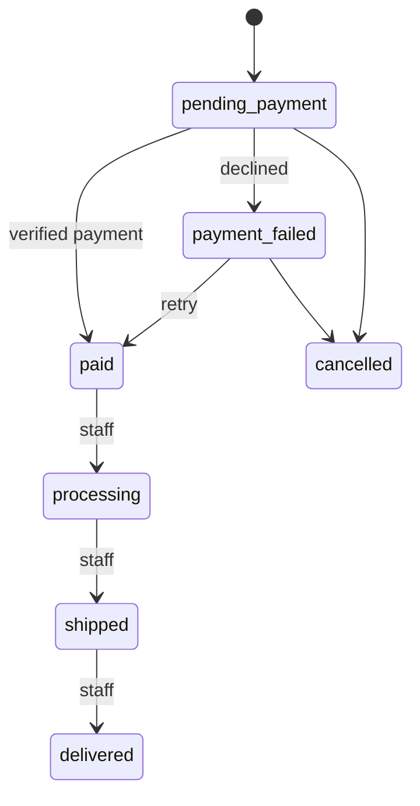
```mermaid
stateDiagram-v2
  [*] --> pending_payment
  pending_payment --> paid: verified payment
  pending_payment --> payment_failed: declined
  payment_failed --> paid: retry
  pending_payment --> cancelled
  payment_failed --> cancelled
  paid --> processing: staff
  processing --> shipped: staff
  shipped --> delivered: staff
```

## Setup guide

**Requirements:** Node.js 20.9 or newer, npm, and (for the automated tests) a local PostgreSQL and Google Chrome.

```bash
git clone https://github.com/Nivetha-K-max/Kitsyuu_E-Commerce.git
cd Kitsyuu_E-Commerce
npm install
```

1. **Environment.** Copy `apps/website/.env.example` to `apps/website/.env.local` and `apps/admin/.env.example` to `apps/admin/.env.local`, then fill in the values. Never commit these files.
   - Each app needs its own database role URL (`WEBSITE_DATABASE_URL`, `ADMIN_DATABASE_URL`). `npm run db:app-role` creates one.
   - `PAYMENT_PROVIDER` is empty by default, which means no online payment. For local development you can opt in to the test payment provider with `PAYMENT_PROVIDER=test` (no money moves); production builds refuse it.
2. **Database.** Migrations are applied with `npm run db:apply`. Read [database/README.md](database/README.md) first: every live change follows a preflight → rehearsal → snapshot → apply → verify procedure.
3. **Run.**

| Command | What |
|---|---|
| `npm run dev:website` | Customer website on http://localhost:3001 |
| `npm run dev:admin` | Admin/ERP on http://localhost:3002 |
| `npm run build:website` · `npm run build:admin` | Production builds |
| `npm run typecheck:packages` · `typecheck:admin` · `typecheck:website` | Type checks |

Use `localhost`, not `127.0.0.1`, in development: Next.js only allows the configured development origin.

## Configuration

Providers and secrets come from each app's environment. Business settings come from the `settings` table. Values nobody has decided stay unset.

| What | Where | Now |
|---|---|---|
| Payment provider | `PAYMENT_PROVIDER` | Unset by default: no online payment, and checkout refuses orders. `test` is opt-in for development and refused in production. The Razorpay adapter is ready but not enabled. |
| Shipping | `ShippingProvider` in `apps/website/lib/commerce.ts` | Not set up: no charge, shown as "Not set up yet" |
| Discounts | `DiscountRule[]` in `apps/website/lib/commerce.ts` | None |
| Tax | `tax_rates` table | One 0 % tax-inclusive prototype rate |
| Unpaid-order hold time | `settings` → `checkout.payment_window_minutes` (migration 1700) | 10 days (14400 minutes). A daily job (`vercel.json`, `CRON_SECRET`) cancels expired unpaid orders and returns their stock |
| Returns and refunds | `apps/website/lib/store-policy.ts` | None: all sales are final (shown in the footer and at checkout) |
| Email | `MAILER` + `RESEND_API_KEY`, `MAIL_FROM` | `resend` (Resend) once the account and sending domain exist; `console` (server log) until then. Account emails and order confirmations |
| Customer session lifetime, login limits | `settings` → `auth.*` | Configured |

## Testing

Every suite runs against a **throwaway local database**, never against Supabase. It needs `database/.env.test.local` with `TEST_PG_ADMIN_URL`, a superuser URL for the local PostgreSQL.

| Command | Covers | Checks |
|---|---|---|
| `npm run test:admin` | Core integration tests (catalogue, staff, customers, commerce, M4 catalogue, M8 operations, orders) and the admin browser tests (including `tests/m8.mjs`) | 7 core suites and the browser checks, with database safety checks before and after each file |
| `npm run test:account -w @kitsyuu/website` | Customer accounts (M6) and commerce (M7), desktop and mobile, including a local fake Razorpay | 90 + 108 checks |
| `npm run test:website` | Storefront: catalogue, product pages, cart, wishlist, search, sorting, guest checkout (needs `node server.cjs` on :3000 and the website on :3001) | 133 checks |

The browser tests drive headless Chrome over the DevTools Protocol, with no test dependencies. They run one at a time because they share a Chrome profile.

## Project structure

```
KITSYUU-Website2/
├── apps/
│   ├── website/        # customer website (Next.js): landing + store, accounts, cart, checkout
│   └── admin/          # Admin/ERP (Next.js)
├── packages/
│   ├── core/           # business services (catalogue, inventory, cart, pricing, checkout, orders, payments…)
│   ├── auth/           # staff + customer authentication, permissions, mailer
│   ├── db/             # database access and typed schema
│   └── contracts/      # validation, order workflow, error types (browser-safe)
├── database/
│   ├── migrations/     # numbered SQL migrations (never edited after being applied)
│   ├── scripts/        # apply / snapshot / verify / role tooling
│   ├── seed/           # prototype catalogue seed
│   └── test/           # local test-database shim and fixtures
├── docs/               # ARCHITECTURE.md, screenshots
├── dist/               # the original static site (landing assets are copied into the website at build time)
├── PRODUCT-DATA.md     # catalogue data guide
└── PRODUCTION-NOTES.md # landing-page media provenance
```

## Future improvements
- **M8 ERP** (built locally, awaiting review): after approval, apply migrations 1800–1900 through the live-migration procedure. Still to come: reports, a reconciliation screen once a payment provider is live, a real courier integration behind `CarrierProvider`.
- **Business decisions to plug in later**: shipping method and charges, real GST rates per product, discount rules (none at launch), and the payment provider going live (Razorpay, tested last).
- **Email going live**: create the Resend account, verify the sending domain, set `MAILER=resend`, `RESEND_API_KEY` and `MAIL_FROM`.
- **After M9**: structured logging with request correlation, external uptime monitoring against `/api/health`, performance budgets. (Checkout rate limiting and the daily unpaid-order expiry job already exist.)
- **Official photography and confirmed product data** (see `PRODUCT-DATA.md`).
- **Continuous integration** running the test suites on every branch.

## Lessons learned
- **Put business logic in one place.** Moving every rule into `packages/core` let the website and the ERP share it, and made the rules testable without a browser.
- **Never trust the browser, and test that you don't.** Tests that tamper with totals, forge payment results and replay webhooks proved the server holds the line.
- **Adapters beat hardcoding.** Building checkout against a payment interface meant the Razorpay integration and a local fake could plug in without touching checkout.
- **Don't invent business rules.** Leaving shipping, tax, discounts and hold times unset kept the platform honest; each is a clearly listed decision, not a hidden guess.
- **Rehearse database changes.** Read-only preflights, dry runs that roll back, and row fingerprints before and after made live migrations uneventful.
- **Flaky tests are real bugs.** Several "random" failures were test helpers reading a page too early; fixing the helpers, not rerunning, made the suites trustworthy.

## Credits
Brand, catalogue and imagery © KITSYUU. Landing-page concept imagery and film are documented in [`PRODUCTION-NOTES.md`](PRODUCTION-NOTES.md). Fonts: Barlow Condensed and DM Sans (Google Fonts, served locally).
