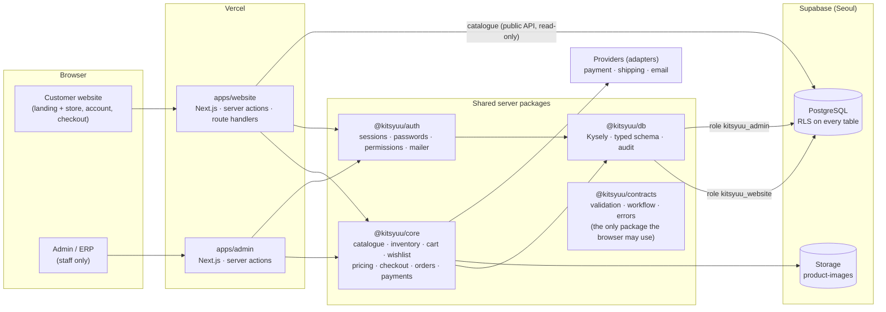
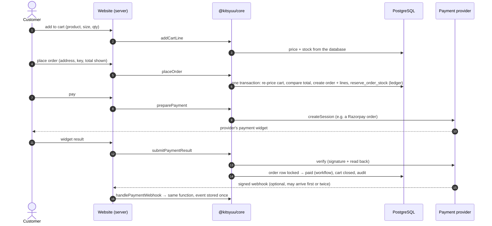
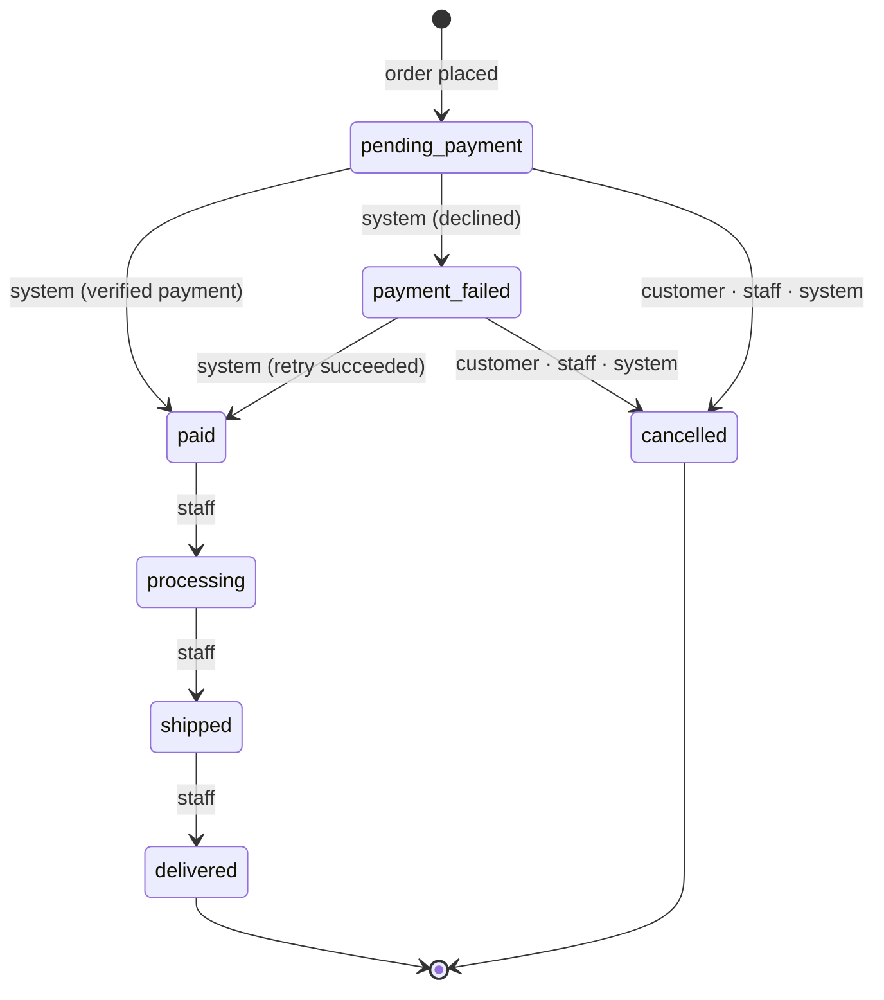

# KITSYUU platform architecture

KITSYUU is an e-commerce store plus an ERP / business-management back office, built as one platform:

- two independently deployable Next.js applications: the **customer website** and the **Admin/ERP**;
- shared **server-only packages** with the business logic;
- one **PostgreSQL database** (Supabase, Seoul) with a separate database role for each application.

This document describes the platform as of **M7 (core commerce)**. For the list of milestones, see the [README](../README.md#status).

## Contents

- [Principles](#principles)
- [System overview](#system-overview)
- [Repository layout](#repository-layout)
- [Database and security model](#database-and-security-model)
- [Authentication](#authentication)
- [Commerce (M7)](#commerce-m7)
- [Order workflow](#order-workflow)
- [Providers and configuration](#providers-and-configuration)
- [Deployment](#deployment)
- [Changing the database safely](#changing-the-database-safely)
- [Decisions that are still open](#decisions-that-are-still-open)

## Principles

- **Business logic lives in `packages/core`.** Pages and server actions validate the input, check the session and call a service. They never query the database for a business operation themselves.
- **Never trust the browser.** Prices, stock, totals and payment results are always worked out or verified on the server.
- **External services are adapters.** Payments, shipping, email, storage, tax and discounts sit behind interfaces. A provider plugs in without changing checkout or orders.
- **No invented business rules.** When a business value has not been decided (for example shipping charges, tax rules, the return window or how long unpaid orders hold stock), the platform leaves it unset and configurable. It does not guess a number.
- **Workflows are configuration.** The order status transitions are declared in one place, per actor. The UI asks the business layer what is allowed.
- **Every important change is audited** in the same transaction as the change (`audit_logs`, append-only).

## System overview

- The **customer website** serves `/` as a single page: the brand landing film, then the store (`#store`). Catalogue pages are statically generated. The header learns the signed-in state from `/api/me`, and a signed-in customer's cart and wishlist from `/api/store`.
- The **Admin/ERP** is a separate app with staff accounts, roles and permissions. It is never served from the customer website.
- The **catalogue** on the website is read through Supabase's public API (row-level security shows only active products). Everything else, including customer data, carts and orders, goes through the website's own database role.

## Repository layout

| Path | Contents |
|---|---|
| `apps/website` | Customer website (Next.js 16): landing + store, customer accounts, cart, wishlist, checkout, payment step, order confirmation |
| `apps/admin` | Admin/ERP (Next.js 16): dashboard, catalogue, variants, images, inventory, orders, staff, roles, audit |
| `packages/core` | Business services (see [packages/core/README.md](../packages/core/README.md)) |
| `packages/auth` | Staff and customer authentication, permissions, mailer |
| `packages/db` | Database access (Kysely), typed schema, audit writer |
| `packages/contracts` | Input validation (zod), order workflow, error types |
| `database/migrations` | Numbered SQL migrations, applied in order, tracked in `app_private.applied_migrations` |
| `database/scripts` | Migration, snapshot and verification tooling |
| `database/test` | Local test-database shim and order fixtures (never used against Supabase) |
| `dist/` | The original static site; its landing assets are copied into the website at build time |

## Database and security model

- **Two application roles.**
  - `kitsyuu_website` has only what the store needs: the catalogue read-only; customers, sessions, addresses, carts, wishlists, orders and payments. It can append to the audit log as `customer` or `system` only.
  - `kitsyuu_admin` has what the ERP needs.
  - Both connect through the Supabase pooler with their own passwords, kept in each app's environment.
- **Row-level security on every table.** On Supabase, the public API roles (`anon`, `authenticated`) receive default table grants, so RLS is the barrier. Every new table enables RLS, and every new function revokes EXECUTE from those roles explicitly.
- **Stock changes only through `public.adjust_stock()`.** It locks the size, refuses to go below zero, and writes the stock ledger row (`inventory_movements`) in the same transaction. A trigger rejects any other change to `stock_qty`.
  - The website role cannot call `adjust_stock()`. M7 gives it two narrow functions: `reserve_order_stock(order)` and `release_order_stock(order)`. They take or return exactly the stock of one order, and only in the right order state.
- **Money** is integer paise. Order amounts are a snapshot, never edited afterwards. How they were worked out (tax rate, shipping method, discounts) is kept in `orders.pricing`.
- **The audit log is append-only**: no role can update or delete it, and a trigger blocks it for everyone.

## Authentication

| | Customers (M6) | Staff (M3) |
|---|---|---|
| Passwords | Argon2id | Argon2id |
| Session | Random 256-bit token in a `__Host-` HttpOnly, Secure, SameSite=Lax cookie. The database stores only its SHA-256. | Same design, separate table |
| Lifetime | Idle and absolute limits from `settings` (`auth.*`) | Idle and absolute limits from `settings` |
| Protection | Per-email and per-IP throttling, no account enumeration, single-use email links | Same, plus invitations, roles and permissions |
| Legacy | Accounts created in Supabase Auth move to platform login on their next login ("verify-on-login"). Supabase Auth is not switched off. | — |

Every page and action re-checks the session on the server. `proxy.ts` only sends visitors without a cookie to the login page early.

## Commerce (M7)

- **Cart.**
  - A guest's cart and wishlist stay in the browser (`localStorage`).
  - After login they are merged once into the customer's database cart and wishlist, then cleared from the browser.
  - The browser only ever says which product, size and quantity. Names, prices, stock and totals are resolved by `priceCart()`, the same function for the cart page, the checkout page and order creation.
- **Tamper and stale checks.** The checkout form carries the total the customer saw (`expectedTotalPaise`). If the server's total differs, the order is refused and nothing is written.
- **Idempotency.**
  - The checkout form carries a random key, so submitting it twice returns the same order.
  - A provider payment id is stored once, and an order is marked paid once.
  - Each webhook event id is stored once in `payment_events`.
  - Payment results from the browser and from webhooks are both applied with the order row locked.
- **Stock.**
  - An order takes its stock when it is created, so two customers cannot buy the last unit (tested with concurrent checkouts).
  - An unpaid order returns its stock through the ledger when it is cancelled, or replaced by a newer checkout of the same cart.
  - It also returns its stock when its payment hold time runs out, but only if a hold time is configured (see [Decisions](#decisions-that-are-still-open)).
- **Failure states**, each shown with a clear message: declined payment (retry allowed), payment window closed, provider unavailable (order kept), database unavailable (checkout error page, no internal details), network cut during payment (nothing marked paid), and an ended session (back to login, then to checkout).

## Order workflow

Declared once in `packages/contracts` (`ORDER_TRANSITIONS_BY_ACTOR`). Every change goes through `applyOrderTransition()` in core, which also writes the status history. Pages ask the workflow what is allowed (for example `customerOrderActions()` decides whether to show Pay or Cancel).

| Actor | May do |
|---|---|
| system (payment flow) | Mark paid or payment failed, only from verified provider data. Cancel an unpaid order that was replaced or whose hold time expired. |
| staff | Move fulfilment forward. Cancel unpaid orders (their stock is returned, attributed to the staff member). |
| customer | Cancel their own unpaid order. |

Refunds and returns are not in this workflow yet (M8).

## Providers and configuration

| Capability | Interface | What is plugged in now | Later |
|---|---|---|---|
| Payments | `PaymentProvider` (`packages/core/src/payments/provider.ts`) | `test`: development only, no money moves; refused in production | `razorpay`: adapter built, test mode only, not enabled |
| Shipping | `ShippingProvider` (`pricing.ts`) | `none`: no charge; pages say "Not set up yet" | Flat rate, rate table or carrier |
| Discounts | `DiscountRule[]` (`pricing.ts`) | No rules | Coupons, sales, customer groups |
| Tax | `tax_rates` table | One 0 % tax-inclusive prototype rate | Real GST rates (per product / HSN) |
| Email | `Mailer` (`packages/auth`) | `console`: messages go to the server log | An email provider |
| Storage | `ObjectStorage` (`packages/core/src/storage.ts`) | Supabase Storage (admin); a local folder in tests | — |

The website chooses providers from its environment (see `apps/website/.env.example`):

| Variable | Meaning |
|---|---|
| `PAYMENT_PROVIDER` | `test` or `razorpay`. Unset = no online payment; checkout says so. |
| `PAYMENTS_TEST_SECRET` / `PAYMENTS_ALLOW_TEST_PROVIDER` | Test provider signing secret. The test provider only runs in production when explicitly allowed (automated tests only). |
| `RAZORPAY_KEY_ID` / `RAZORPAY_KEY_SECRET` / `RAZORPAY_WEBHOOK_SECRET` | Razorpay credentials (server-only; the key id is passed to the browser by the server). Live keys are refused. |
| `JOBS_SECRET` | Enables the scheduled job endpoint `POST /api/jobs/expire-orders`. |

Business settings are rows in `settings`. Values nobody has decided are simply absent.

## Deployment

- Two Vercel projects, one per app. Each is linked to the GitHub repository and deploys `main` automatically.
  - **Website:** region iad1.
  - **Admin:** region icn1.
- Work happens on milestone branches. Nothing reaches `main`, and so production, without explicit approval.
- Each app's secrets (database role URL, provider keys) live only in that Vercel project's environment variables, never in the repository.

## Changing the database safely

Every live migration follows the same steps (see [database/README.md](../database/README.md)):

1. **Read-only preflight** of the live database: migration log, structure, policies, grants and counts, inside a read-only transaction.
2. **Rehearsal** on a throwaway local database built to the live state. Dry runs roll back, and a second run proves the migration is safe to re-run. Every existing row is fingerprinted before and after.
3. **Snapshot**, then apply with `db:apply -- --no-seed`, then snapshot again and compare, then verify the new objects and permissions.
4. Migrations are additive and never edited after being applied. Nothing is dropped, reset or truncated.

## Decisions that are still open

These are business decisions. The platform supports them but does not invent values:

- Shipping method and charges.
- Real tax rules. The current rate is a 0 % prototype placeholder.
- Discount rules.
- How long an unpaid order holds its stock (`checkout.payment_window_minutes`). Unset means unpaid orders hold stock until they are cancelled. **This must be decided before online checkout is enabled in production:** otherwise unpaid orders could keep stock off sale indefinitely. While no payment provider is configured, orders cannot be placed at all.
- Whether customers may cancel their own unpaid orders, and whether a new checkout should replace an older unpaid one (both are how M7 behaves today, via the workflow and checkout service).
- The return and refund policy (M8).
- Which payment provider goes live, and when (Razorpay credentials).
- An email provider (no order emails are sent yet).
